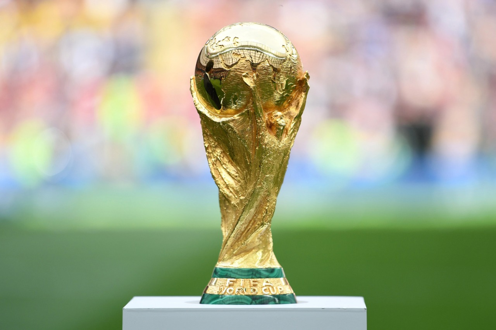
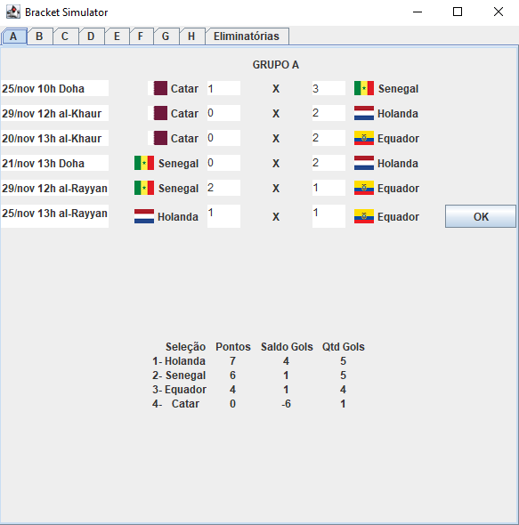
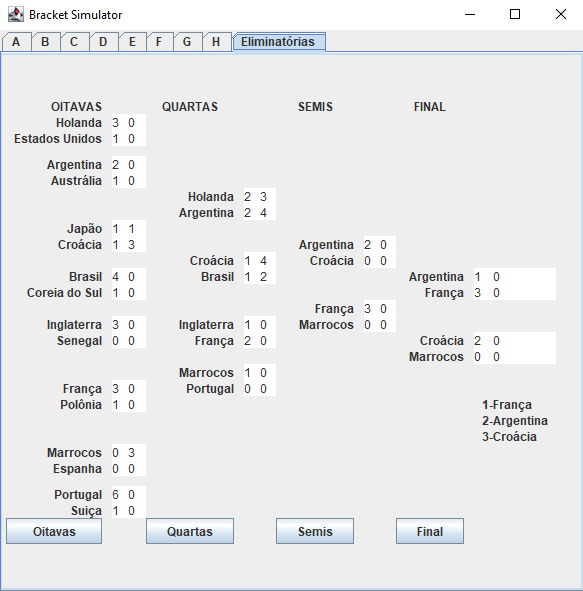

 

  

  <h3 align="center">Tabela da Copa do Mundo 2022</h3>

  
Table of Contents

  <ol>
    <li>
      <a href="#preview">Preview</a>
    </li>
    <li>
      <a href="#sobre-o-projeto">Sobre o projeto</a>
    </li>
    <li>
      <a href="#funcionalidades-e-características-do-projeto">Funcionalidade e características do projeto</a>
    </li>
    <li>
      <a href="#screenshots">Screenshots</a>
    </li>
  </ol>

## Preview
Vídeo de demonstração:  
https://drive.google.com/file/d/1lKrC0s0BcXQ7nZJ8ghM-8yrZFvI6GFfd/view?usp=share_link

## Sobre o projeto
Este projeto foi um trabalho da disciplina de programação orientada a objetos(POO) no segundo semestre da faculdade de ciência da computação.  
Foi feito em java utilizando POO, collections e arquivos.  
O torneio é realizado em duas fases: a fase de grupos e a fase final. Na fase de 
grupos, as 32 seleções são divididas em oito grupos com quatro seleções. Em cada grupo, representados pelas letras A até H, as seleções jogam 
entre si em turno único, e as duas melhores passam para a fase final. Cada seleção, portanto, 
fará três jogos nesta fase. A fase final é realizada em jogos únicos eliminatórios. Nas oitavas de final, os primeiros colocados de cada grupo enfrentam os segundos dos 
grupos posteriores, ou seja, o 1º colocado do grupo A enfrenta o 2º do grupo B, o 1º do grupo B 
joga com o 2º do grupo A, e assim por diante. As oito seleções vencedoras se enfrentam nas 
quartas de final.
Os vencedores das quartas de final, por sua vez, disputam as semifinais, definindo 
assim as duas seleções que jogarão pelo título mundial. Os perdedores das semifinais também 
disputam mais um jogo, decidindo quem fica em terceiro lugar.

## Funcionalidades e características do projeto
<ul>
    <li>
    <h2>Entrada de dados</h2>
        <ul>
            <li>
            O aplicativo recebe do usuário a quantidade de gols marcados por cada seleção em cada um de seus jogos.
            </li>
        </ul>
    </li>
 
    <li>
        <h2>Saída de dados</h2>
            <ul>
                <li>
                Classificação:
                </li>
                <ul>
                    <li>
                    Número de pontos ganhos em todos os jogos(vitória: 3 pontos; Empate: 1 ponto)
                    </li>
                    <li>
                    Saldo de gols em todos os jogos
                    </li>
                    <li>
                     Número de gols marcados em todos os jogos
                    </li>
                    Se duas ou mais seleções empatarem em todos os quesitos acima, o desempate se 
baseará no confronto direto, conforme os critérios a seguir:
                    <li>
                    Número de pontos ganhos nos confrontos diretos entre as seleções empatadas
                    </li>
                    <li>
                    Saldo de gols dos confrontos diretos das seleções empatadas
                    </li>
                    <li>
                    Número de gols marcados nos confrontos diretos das seleções empatadas
                    </li>
                    <li>
                    Sorteio a ser realizado pelo Comitê Organizador da FIFA.
                    </li>
                </ul>
                </li>
                <li>
                Partidas:
                </li>
                <ul>
                    <li>
                    Relação completa dos jogos do torneio, incluindo seus resultados.
                    </li>
                    <li>
                    Os jogos estão organizados por fases(e por grupos, na primeira fase).
                    </li>
                    <li>
                    Data, hora, local(cidade-sede), nome da seleção 1, nome da seleção 2 e quantidade de gols marcados pelas seleções são os dados apresentados em todas as partidas.
                    </li>
                </ul>
            </ul>
        </li>
 
<li>
        <h2>Estrutura dos dados</h2>
            <ul>
                <li>
                O aplicativo utiliza objetos e coleções para armazenar e manipular os dados dos jogos
                </li>
                <li>
                A classificação das seleções é feita por meio da ordenação de coleções.
                </li>
            </ul>
        </li>
     
<li>
        <h2>Persistência de dados</h2>
            <ul>
                <li>
                utilização de arquivos para a persistência de dados.
                </li>
            </ul>
        </li>
        

Fique à vontade para me contatar!

## Screenshots
 
 